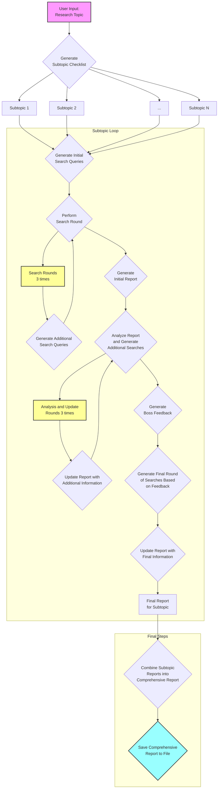

# code flow

## gist

## more detailed, with prompts

```mermaid
graph TB
    style noteB opacity:0
    style noteE opacity:0
    style noteH opacity:0
    style noteI opacity:0
    style noteJ opacity:0
    style noteL opacity:0
    style noteM opacity:0
    style noteN opacity:0
    style noteO opacity:0
    style noteQ opacity:0
    
    style noteTextB fill:#ffd, stroke:#cb6
    style noteTextE fill:#ffd, stroke:#cb6
    style noteTextH fill:#ffd, stroke:#cb6
    style noteTextI fill:#ffd, stroke:#cb6
    style noteTextJ fill:#ffd, stroke:#cb6
    style noteTextL fill:#ffd, stroke:#cb6
    style noteTextM fill:#ffd, stroke:#cb6
    style noteTextN fill:#ffd, stroke:#cb6
    style noteTextO fill:#ffd, stroke:#cb6
    style noteTextQ fill:#ffd, stroke:#cb6
    
    A[User Input:<br>Research Topic] --> B{Generate<br>Subtopic Checklist}
    
    subgraph noteB [" "]
        B -.- noteTextB[Prompt: Generate a detailed checklist of subtopics<br>to research for the topic research_topic.<br>Return your checklist in a Python-parseable list.<br>Return nothing but the list. Do so in one line.<br>Maximum five sub-topics. Start your response with SQUARE BRACKET QUOTE]
    end
    
    B --> D1[Subtopic 1]
    B --> D2[Subtopic 2]
    B --> D3[...]
    B --> Dn[Subtopic N]
   
    subgraph Subtopic Loop
        E{Generate Initial<br>Search Queries} --> F{Perform<br>Search Round}
        
        subgraph noteE [" "]
            E -.- noteTextE[Prompt: Generate 3 search queries to gather<br>information on the subtopic subtopic.<br>Return your queries in a Python-parseable list.<br>Return nothing but the list. Do so in one line.<br>Start your response with SQUARE BRACKET QUOTE]
        end
        
        F --> G[Search Rounds<br>3 times]
        G --> H{Generate Additional<br>Search Queries}
        
        subgraph noteH [" "]
            H -.- noteTextH[Prompt: Here are the search results so far for the<br>subtopic subtopic:<br><br>str_search_data<br><br>---<br><br>Here are all the search queries you have used so far<br>for this subtopic:<br><br>str_all_queries<br><br>---<br><br>Based on the search results and previous queries,<br>generate 3 new and unique search queries to expand<br>the knowledge on the subtopic subtopic.<br>Return your queries in a Python-parseable list.<br>Return nothing but the list. Do so in one line.<br>Start your response with SQUARE BRACKET QUOTE]
        end
        
        H --> F
        F --> I{Generate<br>Initial Report}
        
        subgraph noteI [" "]
            I -.- noteTextI[Prompt: When writing your report, make it incredibly<br>detailed, thorough, specific, and well-structured.<br>Use Markdown for formatting. Analyze the following<br>search data and generate a comprehensive report on<br>the subtopic subtopic:<br><br>str_search_data]
        end
        
        I --> J{Analyze Report<br>and Generate<br>Additional Searches}
        
        subgraph noteJ [" "]
            J -.- noteTextJ[Prompt: Analyze the following report on the subtopic<br>subtopic and identify areas that need more detail<br>or further information:<br><br>report<br><br>---<br><br>Here are all the search queries you have used so far<br>for this subtopic:<br><br>str_all_queries<br><br>---<br><br>Generate 3 new and unique search queries to fill in<br>the gaps and provide more detail on the identified<br>areas. Return your queries in a Python-parseable list.<br>Return nothing but the list. Do so in one line.<br>Start your response with SQUARE BRACKET QUOTE]
        end
        
        J --> K[Analysis and Update<br>Rounds 3 times]
        K --> L{Update Report with<br>Additional Information}
        
        subgraph noteL [" "]
            L -.- noteTextL[Prompt: Update the following report on the subtopic<br>subtopic by incorporating the new information from<br>the additional searches. Keep all existing information...<br>only add new information:<br><br>report<br><br>---<br><br>Additional search data for this round:<br><br>str_round_search_data<br><br>---<br><br>Generate an updated report that includes the new<br>information and provides more detail in the identified<br>areas. Use Markdown for formatting.]
        end
        
        L --> J
        J --> M{Generate<br>Boss Feedback}
        
        subgraph noteM [" "]
            M -.- noteTextM[Prompt: Imagine you are the boss reviewing the<br>following report on the subtopic subtopic:<br><br>report<br><br>---<br><br>Provide constructive feedback on what information<br>is missing or needs further elaboration in the report.<br>Be specific and detailed in your feedback.]
        end
        
        M --> N{Generate Final Round<br>of Searches Based<br>on Feedback}
        
        subgraph noteN [" "]
            N -.- noteTextN[Prompt: Based on the following feedback from the boss<br>regarding the subtopic subtopic:<br><br>feedback<br><br>---<br><br>Generate 3 search queries to find the missing<br>information and address the areas that need further<br>elaboration. Return your queries in a Python-parseable<br>list. Return nothing but the list. Do so in one line.<br>Start your response with SQUARE BRACKET QUOTE]
        end
        
        N --> O{Update Report with<br>Final Information}
        
        subgraph noteO [" "]
            O -.- noteTextO[Prompt: Update the following report on the subtopic<br>subtopic by incorporating the new information from<br>the final round of searches based on the boss's<br>feedback:<br><br>report<br><br>---<br><br>Final search data:<br><br>str_final_search_data<br><br>---<br><br>Generate the final report that addresses the boss's<br>feedback and includes the missing information.<br>Use Markdown for formatting.]
        end
        
        O --> P[Final Report<br>for Subtopic]
    end
   
    D1 --> E
    D2 --> E
    D3 --> E
    Dn --> E
   
    subgraph Final Steps
        P --> Q{Combine Subtopic<br>Reports into<br>Comprehensive Report}
        
        subgraph noteQ [" "]
            Q -.- noteTextQ[Prompt: Generate a comprehensive report on the topic<br>topic by combining the following reports on various<br>subtopics:<br><br>subtopic_reports<br><br>---<br><br>Ensure that the final report is well-structured,<br>coherent, and covers all the important aspects of<br>the topic. Make sure that it includes EVERYTHING in<br>each of the reports, in a better structured, more<br>info-heavy manner. Nothing -- absolutely nothing,<br>should be left out. If you forget to include ANYTHING<br>from any of the previous reports, you will face the<br>consequences. Include a table of contents. Leave<br>nothing out. Use Markdown for formatting.]
        end
        
        Q --> R{Save Comprehensive<br>Report to File}
    end
   
    classDef input fill:#f9f,stroke:#333,stroke-width:2px;
    classDef output fill:#9ff,stroke:#333,stroke-width:2px;
    classDef loop fill:#ff9,stroke:#333,stroke-width:2px;
   
    class A input;
    class R output;
    class G,K loop;
```

# ai-researcher
 

The AI Researcher is an AI agent that utilizes Claude 3 and SERPAPI to perform comprehensive research on a given topic. It breaks down the research process into subtopics, generates individual reports for each subtopic, and then combines them into a final comprehensive report.

## Features

- Generates a detailed checklist of subtopics to research for a given topic
- Performs multiple rounds of searches and analysis for each subtopic
- Generates individual reports for each subtopic
- Incorporates feedback from a "boss" persona to identify missing information and improve the reports
- Combines the subtopic reports into a comprehensive final report

## Usage

1. [Open the notebook in Google Colab](https://colab.research.google.com/drive/1fn2Xisstp0d30_bAaLPA1y-0_svojLF3?usp=sharing) or in a local Jupyter notebook.

2. Replace the placeholders `ANTHROPIC_API_KEY` and `SERP_API_KEY` in the script with your actual API keys.

3. Run all the cells, and enter your topic to get started!

4. After research + generation is complete, the report will be saved as `comprehensive_report.txt` in the same directory as the script. Use a Markdown viewer to view the final report.

## Customization

You can customize the behavior of the AI Research Assistant by modifying the following parameters in the script:

- `model`: The name of the Anthropic Claude AI model to use (default: "claude-3-haiku-20240307").
- `max_tokens`: The maximum number of tokens to generate in each AI response (default: 2000).
- `temperature`: The temperature value for controlling the randomness of the AI responses (default: 0.7).

## Limitations

- The quality and accuracy of the generated reports depend on the performance of the Anthropic Claude AI and the relevance of the search results from SERPAPI.
- The script may take a considerable amount of time to execute, especially for complex topics with multiple subtopics.

## License

This project is licensed under the [MIT License](LICENSE).

## Disclaimer

The AI Research Assistant is an experimental tool and should be used for informational purposes only. The generated reports may contain inaccuracies or inconsistencies. Always verify the information obtained from the script with reliable sources before making any decisions based on it.

## Contributing

Contributions to the AI Research Assistant are welcome! If you find any issues or have suggestions for improvements, please open an issue or submit a pull request on the GitHub repository.

## Acknowledgments

- [Anthropic](https://www.anthropic.com/) for providing the Claude AI API.
- [SERPAPI](https://serpapi.com/) for providing the search API.

## Contact

Matt Shumer - [@mattshumer_](https://twitter.com/mattshumer_)

Lastly, if you want to try something even cooler than this, sign up for [HyperWrite Personal Assistant](https://app.hyperwriteai.com/personalassistant) (most of my time is spent on this). It's basically an AI with access to real-time information that a) is incredible at writing naturally, and b) can operate your web browser to complete tasks for you.
